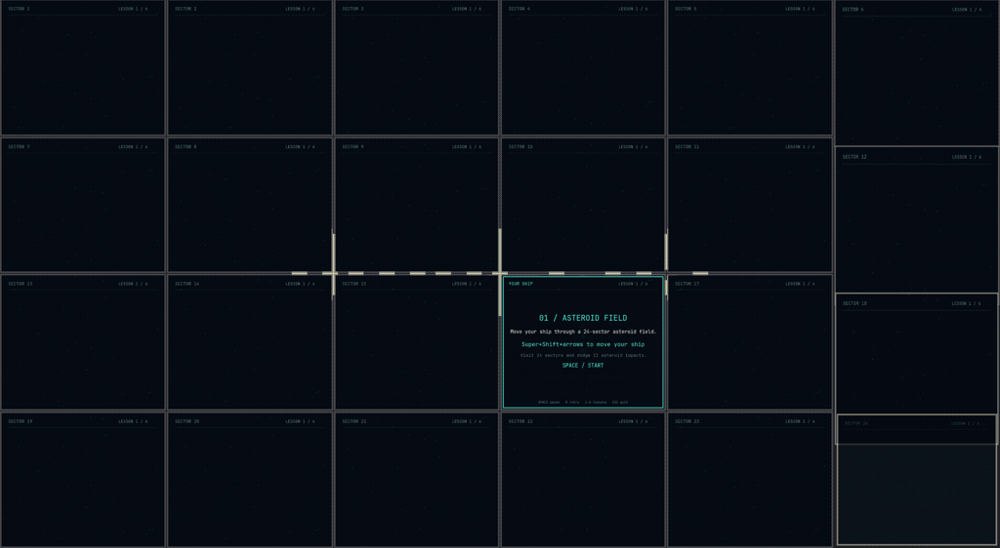

# Hyprsplitter

**Omarchy only.** A spaceship flight school for real Omarchy window shortcuts.
This prototype is built and supported for Omarchy with Hyprland's Lua API
(tested on Hyprland 0.56.2). Other desktops and standalone Hyprland setups
are not supported.
Each lesson is a separate small game with one objective and its own board.
The windows really move, rotate, resize, float, fullscreen, and close.


## Gameplay



## Install on Omarchy

Open a terminal in your Omarchy desktop and run:

```sh
omarchy pkg add git python python-gobject python-cairo gtk3
git clone https://github.com/gardnmi/hyprsplitter.git
cd hyprsplitter
./play
```

The package command asks for your password if dependencies need installing.
Run the game as your normal user. No Python virtual environment or pip install
is needed; `play` uses Omarchy's system Python and GTK packages.

To update an existing checkout:

```sh
cd hyprsplitter
git pull --ff-only
./play
```

## Choose a lesson

```sh
./play
./play --lesson lasers
./play --lesson shoot
./play --lesson float
./play --lesson invasion
```

Press **Space** to start. Finish a lesson, then press Space for the next one.
**R** retries the current lesson; **1–6** jumps to a lesson; **Escape** quits.
Super means the Windows key. Your normal desktop bindings remain active.

## Flight school

| Phase | Game | Task |
| --- | --- | --- |
| 1 | Asteroid field | Super+Shift+arrows moves the ship through all 24 tiles (6 × 4). Dodge 12 impacts. Overlapping bursts arrive every 1.2–2 seconds, with solo rocks and clusters of up to 6. Each rock gets a 2.6-second countdown; at most 10 sectors are threatened at once. |
| 2 | Laser gates | Only 2 windows. Super+J rotates the split; Super+Shift+arrows swaps sides. Move to the marked safe half for 4 gates. |
| 3 | Target practice | Super+arrows selects a red enemy. Super+W closes that actual window and destroys the ship. Close 10 red enemies in a 16-window formation; protect the 5 green friendlies and your cyan ship. |
| 4 | Docking | Super+T undocks a compact ship. Hold Super and left-drag the entire window into the large green bay. When it says ALIGNED, Super+T docks. |
| 5 | Cargo bay | Super+minus/equals changes width. Reach 120%, then restore 100%. |
| 6 | Secret weapon | An invasion approaches. Fullscreen charges the weapon for 2.5 seconds; maximize releases a shockwave that destroys the fleet. |

The game displays the next action needed, progress, and a completion screen.
Friendlies have green borders, shield emblems, and DO NOT FIRE labels.
Closing a friendly retries target practice with a FRIENDLY HIT explanation.
Mistakes give feedback and another attempt. Closing the wrong tile restores the
current exercise with an explanation. Selecting a window alone never destroys it.
There is no auto-fire, health, energy, boss, or combined survival mode.

Fullscreen, maximize, float, split, and close hints are read from installed
binding descriptions. On this development machine, **Super+Alt+F is fullscreen**
and **Super+F is maximize**. Stock Omarchy uses the reverse assignment.
In the invasion mission, press **Super+Alt+F to charge**, wait for CHARGED,
then **Super+F to release** on this machine. The fleet, charge rings, and
expanding shockwave animate across the ship window. Leaving fullscreen too
early resets the charge. Native actions work even if their shortcuts are customized.

## Requirements

- Omarchy running Hyprland with the Lua dispatcher API (tested on 0.56.2)
- Dwindle layout with `preserve_split` and `use_active_for_splits` enabled
- Python 3, PyGObject, GTK 3, and Cairo

A board opens on the first unused workspace starting at 90. Only a temporary
rule matching this process's windows is installed. It is disabled on exit;
no desktop configuration files or global keybindings are changed. Switching
away pauses progress. Escape closes the board and restores the previous focus
when exiting from the lesson workspace.

## Development

```sh
python -m unittest -v
./play --smoke-test
```

Unit tests cover isolated lesson objectives, timing, retry behavior, and native
geometry interpretation. The live smoke test exercises real swaps, split
rotation, focus, enemy closes, docking, resizing, fullscreen charging, maximize release, and
recovery after friendly fire.

Previous combat prototypes remain available in Git tags through `v0.3.2`.
